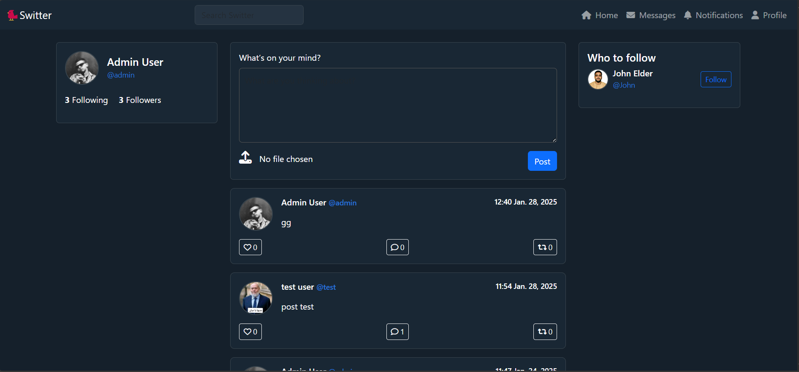
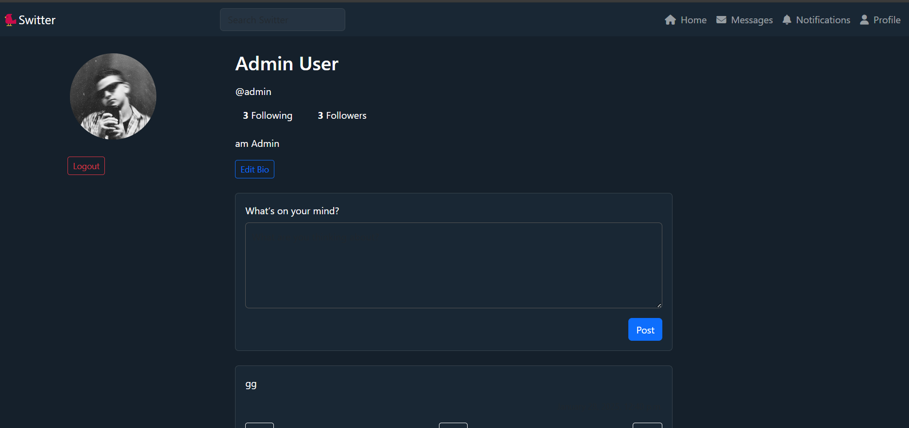
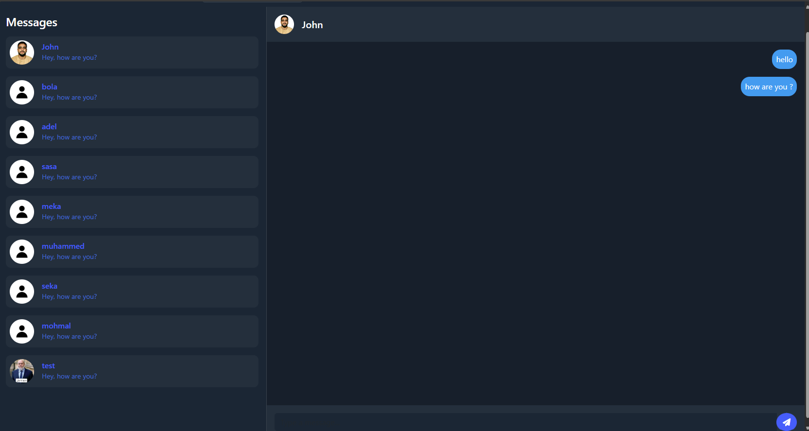

# Switter - Twitter Clone

## Overview
Switter is a feature-rich Twitter clone built with Django. It provides a full-fledged social media experience, including post creation, reactions, comments, replies, a follow system, real-time chat, and a custom recommendation algorithm. The project is containerized with Docker and optimized with caching.

##  Features
- **User Authentication**: Secure login/logout, profile management, and avatar support using `django-allauth`.
- **Post System**: Create, edit, delete, and share posts with media attachments.
- **Reactions & Comments**: Like posts, comment with threaded replies, and engage with other users.
- **Follow System**: Follow/unfollow users and get personalized recommendations.
- **Real-Time Chat**: Built using Django Channels and WebSockets for instant messaging.
- **Recommendation Algorithm**: Custom-built Algorithm to suggest relevant posts and users.
- **Caching**: Redis integration for optimized performance.
- **Containerization**: Dockerized for easy deployment and scalability.
- **Testing**: Simple tests written using `pytest`.

## 🛠 Tech Stack
- **Backend**: Django, Django Channels, WebSockets, django-allauth
- **Database**: PostgreSQL
- **Caching**: Redis
- **Containerization**: Docker
- **Frontend**: Bootstrap, JavaScript
- **Testing**: pytest

## Installation
### Prerequisites
- Docker & Docker Compose installed
- PostgreSQL & Redis setup (if not using Docker)

### Steps
```bash
# Clone the repository
git clone https://github.com/OmarMuhammmed/Switter.git
cd Switter

# Build and start the containers
docker-compose up --build
```

The application should now be running on `http://localhost:8000/`.


## Screenshots




## License
This project is open-source and available under the [MIT License](LICENSE).

